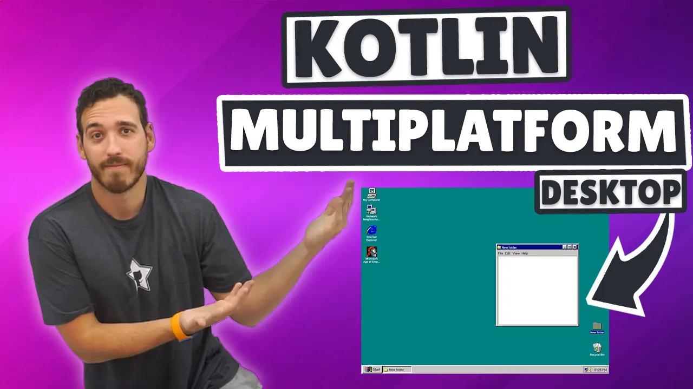
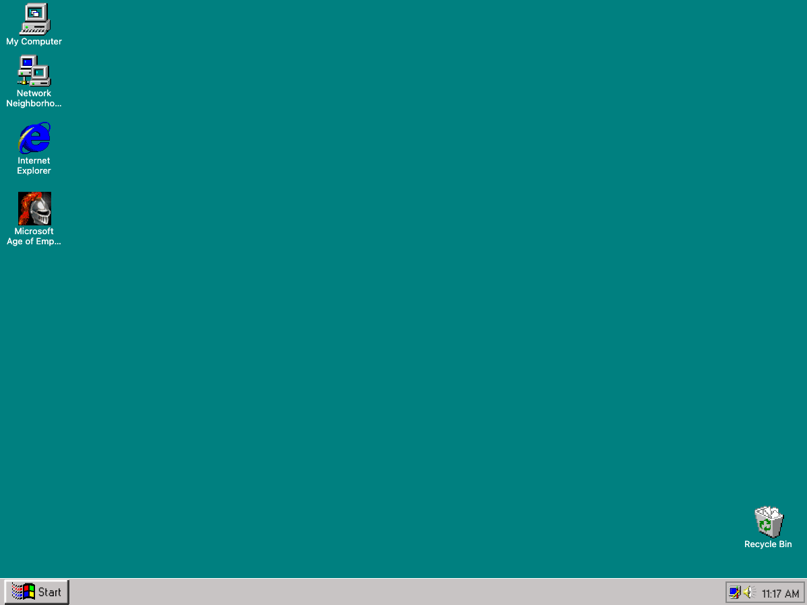
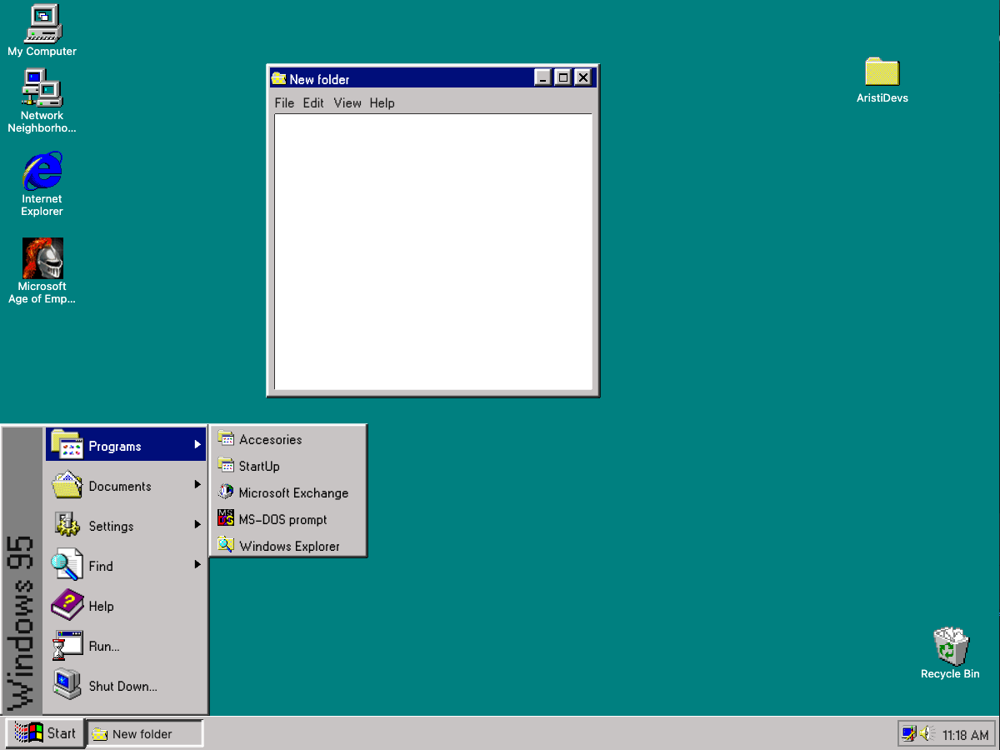
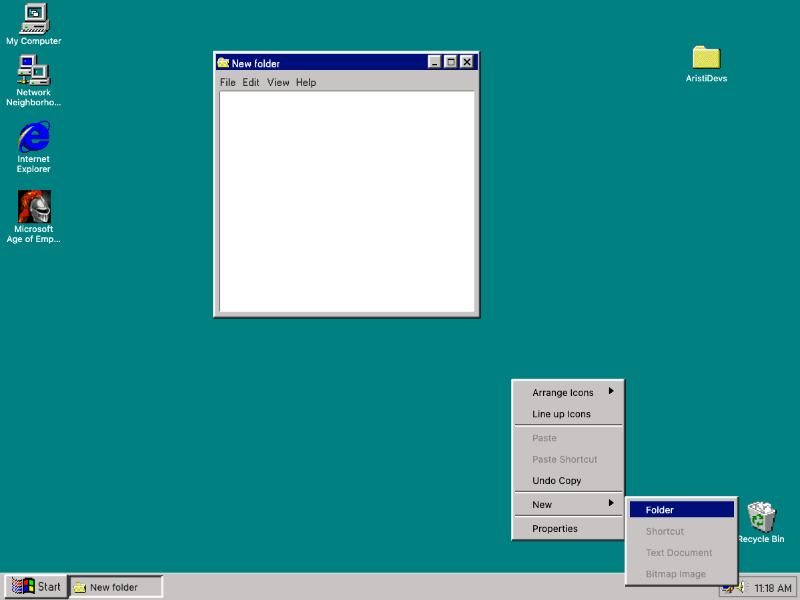

> [!NOTE]  
> 🌐 Este README también está disponible en [Español](README.md).

# Kotlin Multiplatform Course - Windows 95

This project is a Kotlin Multiplatform (KMP) implementation of the iconic Windows 95. It combines modern development practices with a nostalgic interface.

<p align="center">
<a href="https://youtu.be/QFPTUwFW9p8"></center></a></p>

<p align="center">     </p>

----------

## Learn to DEVELOP multiplatform applications with Kotlin

### Course Content

<br />

- [Chapter 1 - Project Setup](https://www.youtube.com/watch?v=QFPTUwFW9p8&t=160s)
- [Chapter 2 - Preparing the Splash](https://www.youtube.com/watch?v=QFPTUwFW9p8&t=545s)
- [Chapter 3 - Typography](https://www.youtube.com/watch?v=QFPTUwFW9p8&t=1585s)
- [Chapter 4 - Windows Bar](https://www.youtube.com/watch?v=QFPTUwFW9p8&t=1865s)
- [Chapter 5 - Bottom Menu](https://www.youtube.com/watch?v=QFPTUwFW9p8&t=4354s)
- [Chapter 6 - Folders](https://www.youtube.com/watch?v=QFPTUwFW9p8&t=7936s)
- [Chapter 7 - Windows](https://www.youtube.com/watch?v=QFPTUwFW9p8&t=10250s)
- [Chapter 8 - PopUp](https://www.youtube.com/watch?v=QFPTUwFW9p8&t=15252s)
- [Chapter 9 - Sorting Folders](https://www.youtube.com/watch?v=QFPTUwFW9p8&t=18706s)
- [Chapter 10 - Final Touches](https://www.youtube.com/watch?v=QFPTUwFW9p8&t=19566s)

----------

## 🛠 Installation

### Requirements

- **Kotlin 2.0.21+**
- **Compose Multiplatform 1.7.0+**
- **KMP-compatible IDE**: Fleet or Android Studio.
- Basic knowledge of Kotlin and KMP.

### Setup

1. Clone this repository:

    ```bash
    git clone https://github.com/ArisGuimera/Windows95KMP.git
    ```

2. Open the project in Android Studio or Fleet.
3. Sync the Gradle project to download dependencies.

----------

## Project Images

|                               Main Screen                               |
|:------------------------------------------------------------------------:|
|    |

|                               Bottom Menu                               |
|:------------------------------------------------------------------------:|
|    |

|                               Right-Click Menu                               |
|:------------------------------------------------------------------------:|
|    |

----------

## ✏️ Project Structure

### Components

Find all components in `ComposeApp/src/desktopMain/kotlin/com/aristidevs/myWindows95/components`. The components are designed to be as generic as possible to allow customization and reusability. Example: **WindowsButton**

```kotlin
WindowsButton(){
    Text("Basic example")
}

WindowsButton(Modifier.height(60.dp), onClick = {print("Example"}, dotPadding = 6.dp)){
    //Any view
}
```

### Helpers

In `ComposeApp/src/desktopMain/kotlin/com/aristidevs/myWindows95/helper`, you’ll find the `SoundManager`, responsible for playing the splash music.

### Extensions

All extension functions are located in `ComposeApp/src/desktopMain/kotlin/com/aristidevs/myWindows95/extensions`.

```kotlin
Modifier.onRightClick {}

Modifier.clickableWithoutRipple {}

Modifier.rotateVertically()

//And more
```

### Models

All data models are in `ComposeApp/src/desktopMain/kotlin/com/aristidevs/myWindows95/model`.

### Splash Screen

The first screen of the project, always launched when the app starts: `ComposeApp/src/desktopMain/kotlin/com/aristidevs/myWindows95/splash/`.

### Windows 95

The main screen of the project: `ComposeApp/src/desktopMain/kotlin/com/aristidevs/myWindows95/windows95`.

----------

## 🌍 Supported Platforms

- **Windows**
- **MacOS**
- **Linux**

----------

## 🤝 Contributing

If you’d like to support my work, you can do so through the following means:

- Give a ⭐ to the project.
- Share the [original tweet]() to help it reach more people.
- Follow me on my [social media](https://aristi.dev).

Every contribution is welcome and helps me continue creating content and open-source projects!

----------

## 👨‍💻 Author

Developed by **AristiDevs**.

- [YouTube](https://www.youtube.com/@ArisGuimera)
- [Twitter](https://twitter.com/ArisGuimera)
- [LinkedIn](https://www.linkedin.com/in/arisguimera/)

----------

## 🚀 AppCademy.dev

<p align="center">
<a href="https://appcademy.dev"></center></a></p>

This course is sponsored by [AppCademy.dev](https://appcademy.dev), my premium platform where we not only learn technologies but also dive deep into their development using best practices and advanced techniques.
